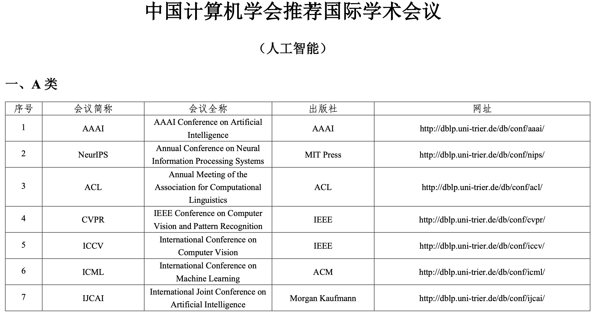
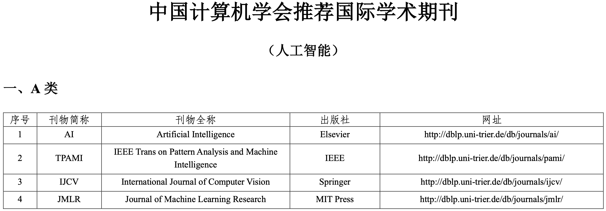
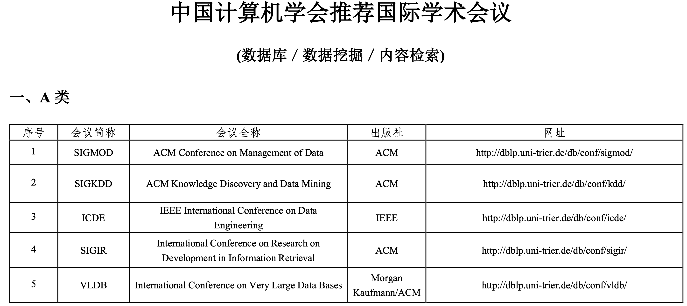
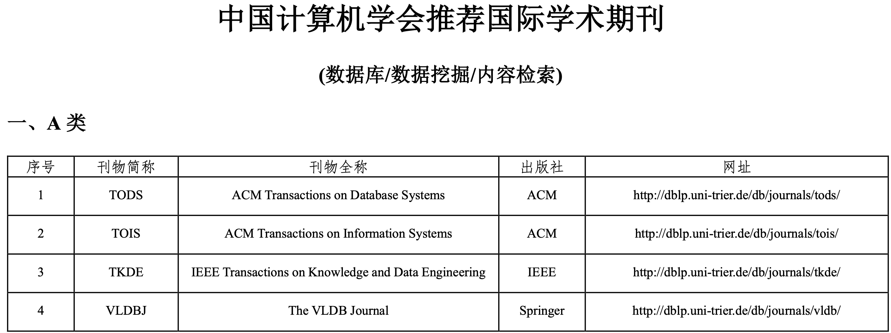

| 类别 |  论文   | 发表 | 简介  |
| --- |  ----  |  ----|----  |
| 多任务学习 | Modeling Task Relationships in Multi-task Learning with Multi-gate Mixture-of-Experts                           | | mmoe |
| 多任务学习 | Progressive Layered Extraction (PLE): A Novel Multi-Task Learning (MTL) Model for Personalized Recommendations  | ACM RecSys2020 | 腾讯提出，对mmoe进行了改良 |
| 多任务学习 | Multi-Task Learning Using Uncertainty to Weigh Losses for Scene Geometry and Semantics                          | CVPR2018 |引入贝叶斯框架自动设置loss权重 |
| 多任务学习 | NeurIPS-2018-multi-task-learning-as-multi-objective-optimization-Paper                          | NeurIPS2018 |还没看.. |
| 多任务学习 | Adversarial Mixture Of Experts with Category Hierarchy Soft Constraint | [ICDE2021](https://icde2021.gr/accepted-papers/)， IEEE 37th International Conference on Data Engineering |多类目MoE模型在京东搜索精排中的应用 |
| 多任务学习 | An Overview of Multi-Task Learning in Deep Neural Networks | Arxiv |概览，感觉一般 |
| 多标签分类 | Deep Learning with a Rethinking Structure for Multi-label Classification | [ACML2019](http://www.acml-conf.org/2019/conference/accepted-papers/)，Asian Conference on Machine Learning |CCF C 大概看看 |
| 计算机视觉 | Squeeze-and-Excitation Networks | [CVPR2018](https://openaccess.thecvf.com/content_cvpr_2018/html/Hu_Squeeze-and-Excitation_Networks_CVPR_2018_paper.html)， Conference on Computer Vision and Pattern Recognition |CCF A，se block很实用 |

 

